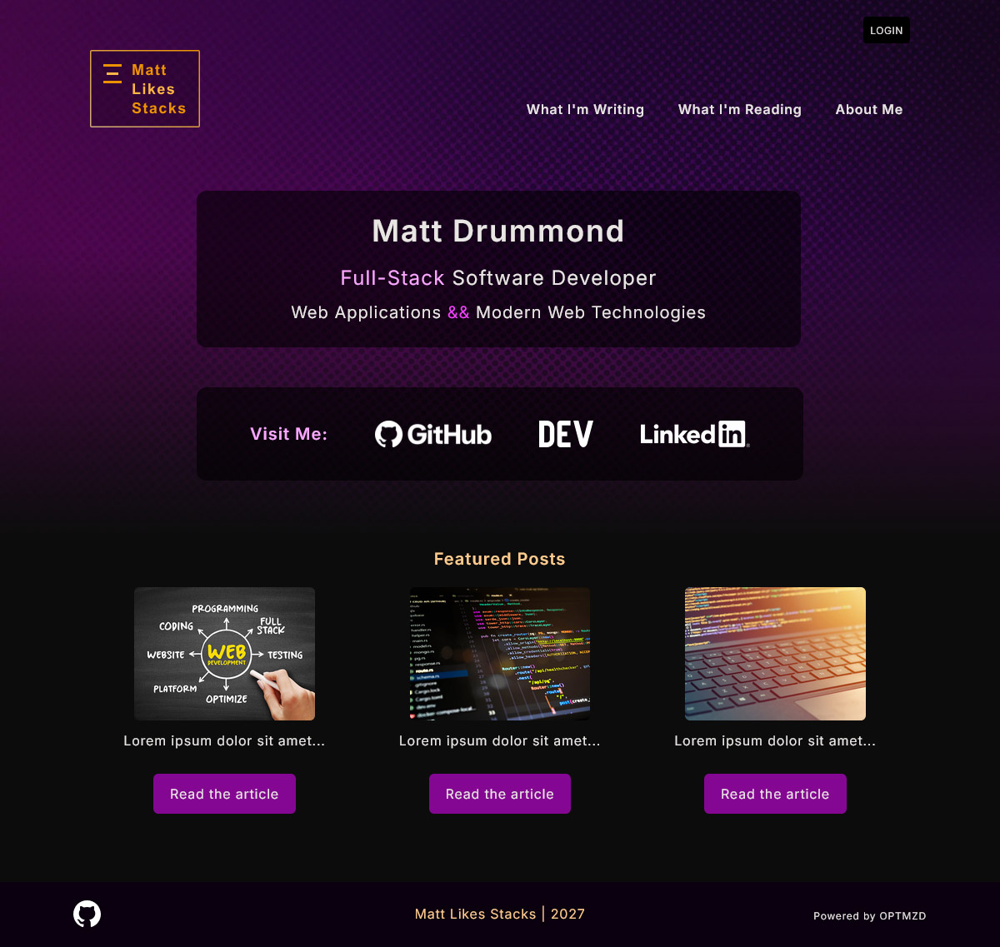
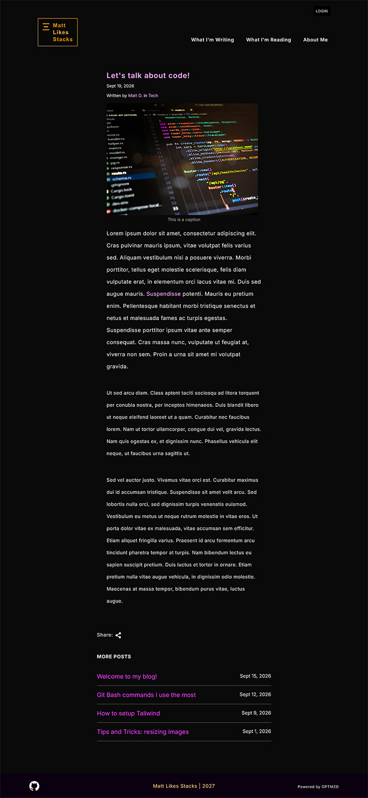
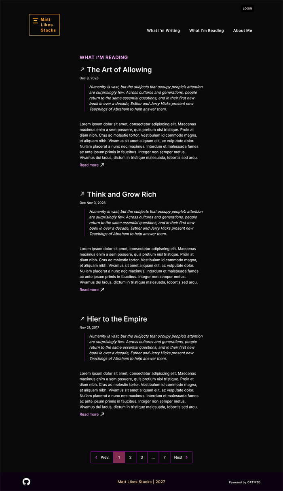
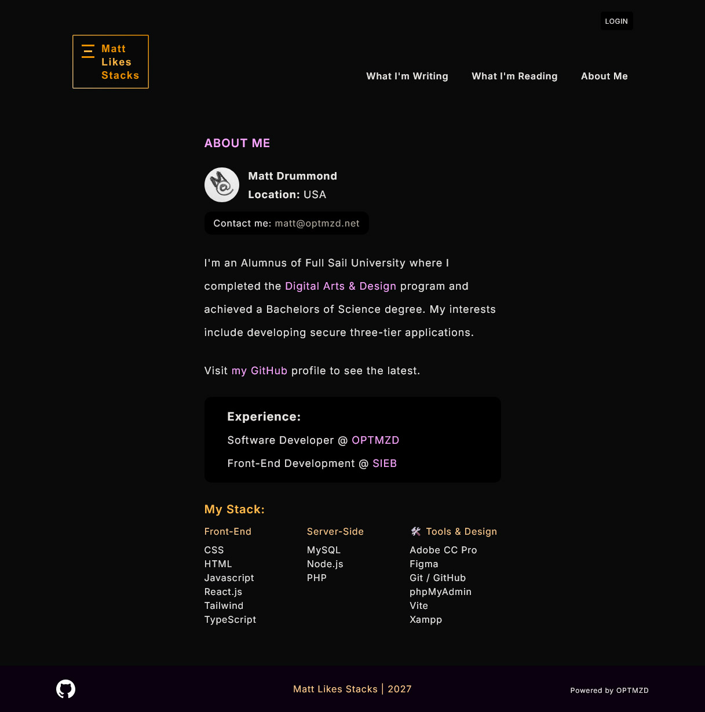
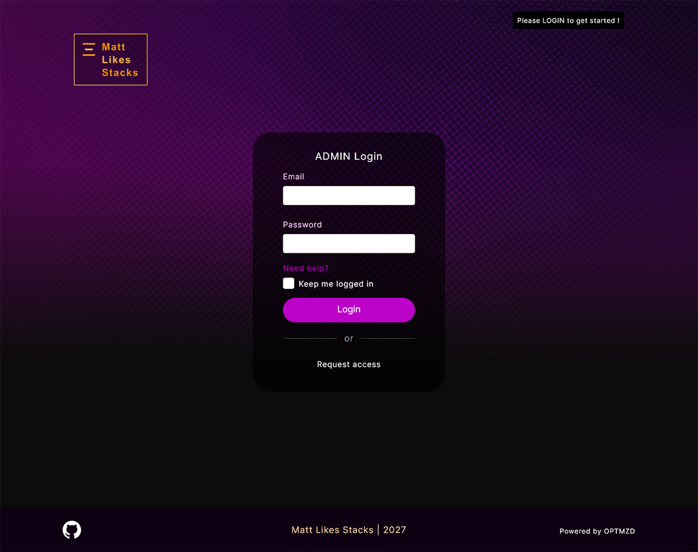
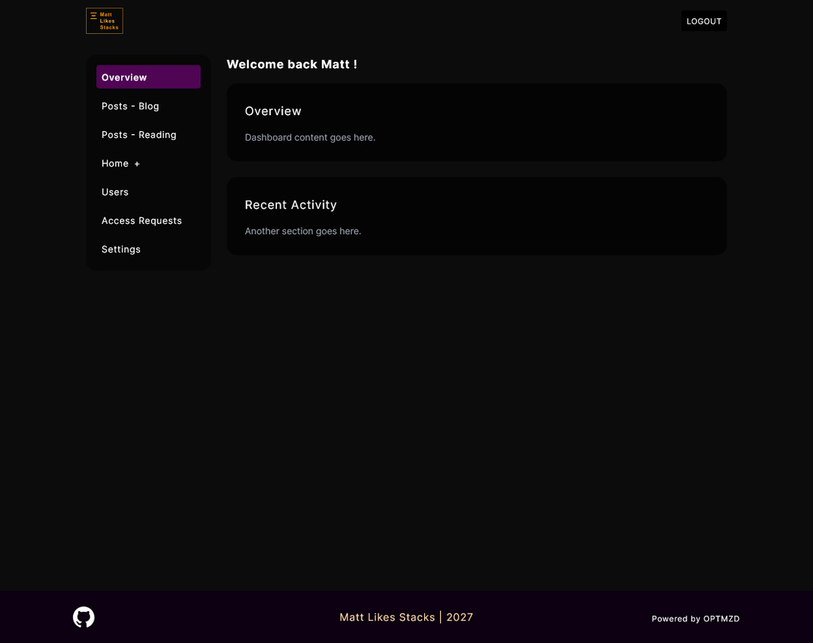
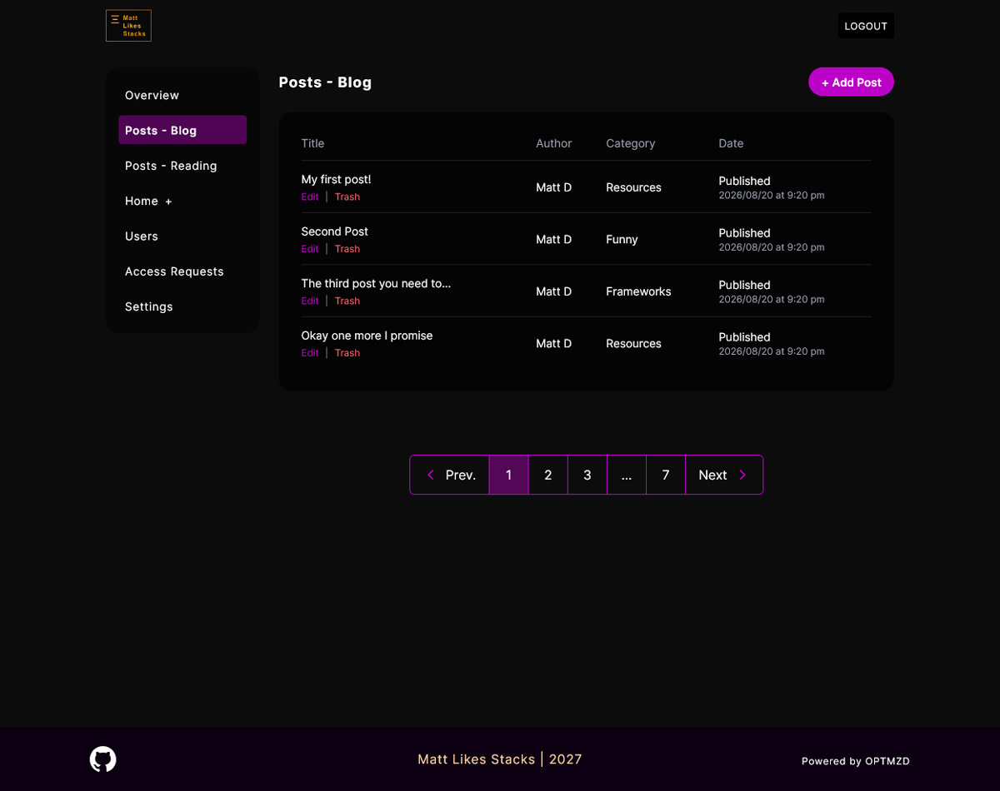

## Dynamic Blogging Application

A custom blogging platform with a public frontend and an admin CMS for managing posts. I'm building it to learn how the whole web stack fits together.

**Stack:** Vite, Tailwind CSS, Figma. Backend planned with PHP and MySQL.

### Status
- [x] Visual design in Figma
- [x] Vite and Tailwind setup
- [x] Client-side frontend
- [ ] Admin / CMS frontend (in progress)

### Planned
- User authentication and protected content
- Relational database for users, posts, categories, and comments
- REST API endpoints between frontend and backend

&nbsp;

### Screenshots - Client Side

&nbsp;

&nbsp;

&nbsp;

&nbsp;

### Screenshots - Admin

&nbsp;

&nbsp;

